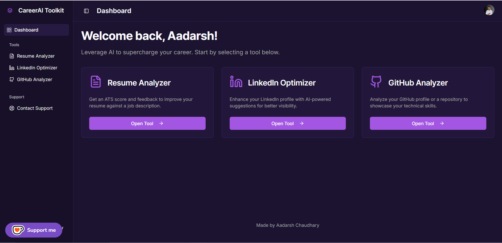

# 🚀 CareerAI Toolkit API

AI-powered toolkit for **Resume Analysis**, **LinkedIn Profile Optimization**, and **GitHub Profile/Repository Insights** — built with **FastAPI** and powered by **Google Gemini**.

---

## 🔗 Live Application

**Access the web app here**: [Live](https://careerai-toolkit.vercel.app/)

---

## 📸 Screenshots

  
*CareerAI Toolkit Landing Page*

  
*CareerAI Toolkit Dashboard*

---

## 📌 Features

### **1. Resume Analyzer**
- **With Job Description** → ATS-style score + gap analysis
- **Comprehensive Analysis** → Strengths, weaknesses, and improvement plan
- Smart scoring that uses both LLM insights and keyword matching

### **2. LinkedIn Optimizer**
- Profile strength score (0–100)
- Detailed feedback on headline, summary, skills, and activity
- SEO keyword suggestions for better reach

### **3. GitHub Analyzer**
- **Profile Analysis** → Tech stack diversity, activity trends, language distribution
- **Repository Analysis** → README clarity, documentation quality, and suggestions
- Recharts for language distribution and repository creation activity

---

## 🏗️ Tech Stack

- **Backend**: FastAPI
- **AI/LLM**: Google Gemini API
- **Data Fetching**: httpx
- **PDF Parsing**: PyMuPDF (fitz)
- **Data Models**: Pydantic v2
- **Environment Management**: python-dotenv

---

## ⚙️ Installation

1. Clone the repository:
   ```bash
   git clone https://github.com/YOUR_USERNAME/careerai-toolkit.git
   cd careerai-toolkit
   ```

2. Create and activate a virtual environment:
   ```bash
   python3 -m venv .venv
   source .venv/bin/activate   # On Windows use: .venv\Scripts\activate
   ```

3. Install dependencies:
   ```bash
   pip install -r requirements.txt
   ```

4. Create a `.env` file:
   ```env
   GEMINI_API_KEY=your_gemini_api_key_here
   GITHUB_TOKEN=optional_github_pat_here
   ```

5. Run the server:
   ```bash
   uvicorn main:app --host 0.0.0.0 --port 8000 --reload
   ```

---

## 📡 API Endpoints

| Method | Endpoint | Description |
|--------|----------|-------------|
| `GET` | `/health` | Health check |
| `POST` | `/api/resume-analyzer/job-description` | Analyze resume against a job description |
| `POST` | `/api/resume-analyzer/comprehensive` | Full resume analysis without job description |
| `POST` | `/api/linkedin-optimizer` | LinkedIn PDF profile optimization |
| `POST` | `/api/github-analyzer/profile` | GitHub profile insights |
| `POST` | `/api/github-analyzer/repository` | Analyze single repository's README |

---

## 📄 Example Request: Resume Analyzer (with Job Description)

```bash
curl -X POST "http://localhost:8000/api/resume-analyzer/job-description"   -F "resume=@resume.pdf"   -F "jobDescription=Data Scientist with Python and ML experience"
```

**Sample Response**
```json
{
  "score": 82.5,
  "summaryFeedback": "Your summary is clear but could be more achievement-focused.",
  "skillsFeedback": "Strong Python skills, but cloud computing missing.",
  "experienceFeedback": "Relevant, but quantify impact more.",
  "educationFeedback": "Aligned with the role.",
  "projectFeedback": "Impressive ML projects, but missing deployment details.",
  "jobRoleSuggestions": "Data Scientist, ML Engineer",
  "overallSuggestions": "Add cloud experience, metrics for achievements."
}
```

---

## 📊 GitHub Profile Analysis Output Example

```json
{
  "techStack": "Primarily Python with some JavaScript...",
  "codeQualityInsights": "Consistent commit messages, descriptive repo names...",
  "languageDistribution": [
    {"name": "Python", "value": 12},
    {"name": "JavaScript", "value": 3}
  ],
  "repositoryCreationActivity": [
    {"name": "2023", "value": 5},
    {"name": "2024", "value": 7}
  ],
  "overallSuggestions": "Improve README documentation and add CI/CD pipelines."
}
```

---

## 🧪 Development Notes
- All AI prompts are carefully crafted for **structured JSON outputs**
- `ensure_string_values()` ensures LLM responses don’t break Pydantic validation
- Uses `async` for non-blocking API calls to Gemini and GitHub
- Mermaid syntax used for chart generation (language distribution + activity)

---

## 🤝 Contributing
1. Fork the repo
2. Create a new branch (`feature/your-feature`)
3. Commit changes
4. Push branch
5. Open a Pull Request

---

## 📜 License
MIT License

---

## 🌟 Acknowledgements
- Google Gemini for powering the AI analysis
- FastAPI for making API development fun
- Open Source for inspiration and tools

---

## 👨‍💻 Author

**Aadarsh Chaudhary**  
- 🌐 [Portfolio](https://aadrsh.netlify.app/)  
- 💼 [LinkedIn](https://www.linkedin.com/in/aadarshchaudhary/)  
- 💻 [GitHub](https://github.com/AdrshChaudhary)

